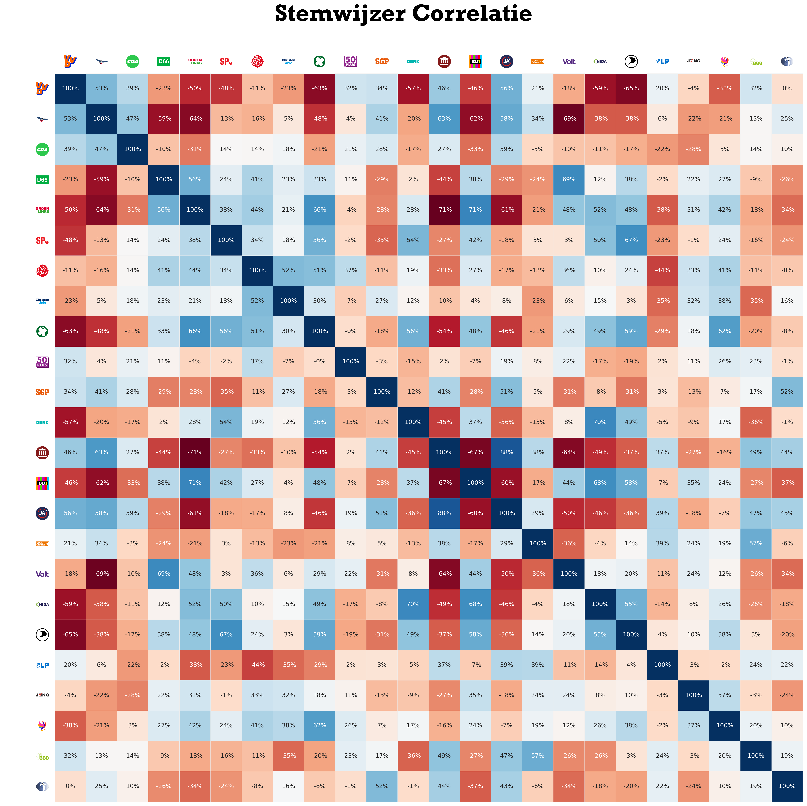

# Stemwijzer Analyse

Politiek spectrum en politiek kompas op basis van Stemwijzer stellingen. Belangrijk: dit is een benadering van de werkelijkheid en geen exacte wetenschap.

## Correlatie

### Correlatie tussen zittende partijen

### Correlatie tussen zittende partijen en niet-zittende partijen

### Correlatie tussen alle partijen

