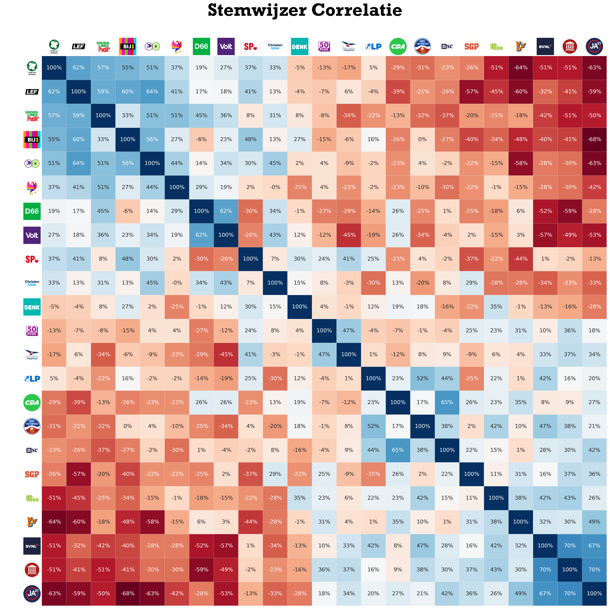

# Stemwijzer Analyse

Politiek spectrum en politiek kompas op basis van Stemwijzer stellingen. Note: dit is een benadering van de werkelijkheid en geen exacte wetenschap.

## Correlatie
### Correlatie tussen zittende partijen

### Correlatie tussen zittende partijen en niet-zittende partijen

### Correlatie tussen alle partijen

## Politiek Spectrum
Aan de hand van het eerste principal component (verklaard 55.1% van de totale Stemwijzer variantie).

## Politiek Kompas
Aan de hand van de eeste twee principal componenten (verklaren samen 54.7% van de total Stemwijzer variantie). Zie [Political Compass](https://www.politicalcompass.org/).
